# Active Directory Lab: Windows Server & Windows 11

## Overview

This project documents an Active Directory lab built with Oracle VirtualBox, Windows Server, and a Windows 11 client virtual machine. The goal was to practice domain setup, user and group management, DNS configuration, domain joining, and basic troubleshooting.

This lab simulates a small business environment where a Windows Server domain controller manages users, groups, and computer authentication.

---

## Lab Environment

| Component | Purpose |
|---|---|
| Oracle VirtualBox | Virtualization platform |
| Windows Server 2022 | Domain Controller, DNS, Active Directory Domain Services |
| Windows 11 Pro | Domain-joined client workstation |
| Internal Network | Private lab network between server and client |

---

## Network Configuration

| Device | IP Address | Role |
|---|---|---|
| Windows Server | 192.168.10.10 | Domain Controller / DNS |
| Windows 11 Client | 192.168.10.20 | Domain-joined workstation |

**Domain name:** `lab1.local`

---

## Project Objectives

- Install and configure Windows Server
- Configure a static IP address on the server
- Install Active Directory Domain Services
- Promote the server to a domain controller
- Create organizational units, groups, and users
- Configure Windows 11 network settings
- Join Windows 11 to the domain
- Test domain user login
- Verify domain authentication from the command line

---

## Steps Completed

### 1. Installed Windows Server

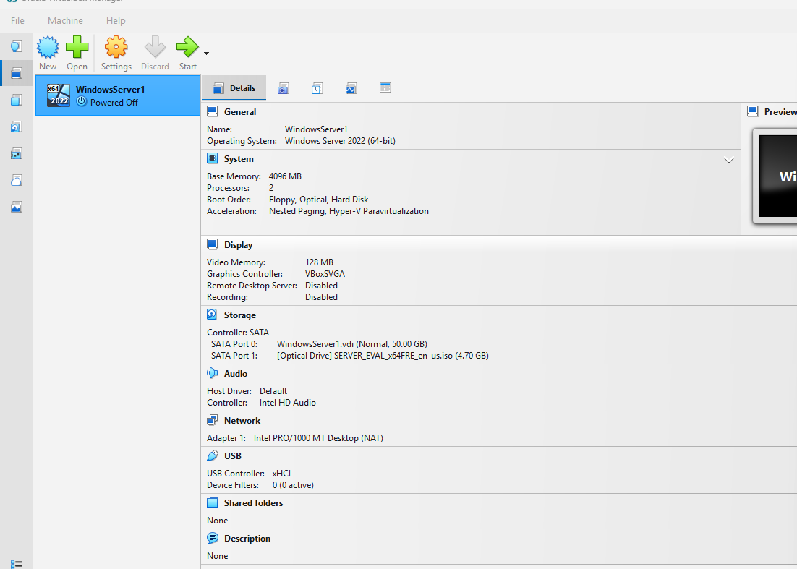

I installed Windows Server in a virtual machine to use as the main server for the lab. This server was later configured as the domain controller for the Active Directory environment.

---

### 2. Confirmed Windows Server Was Running

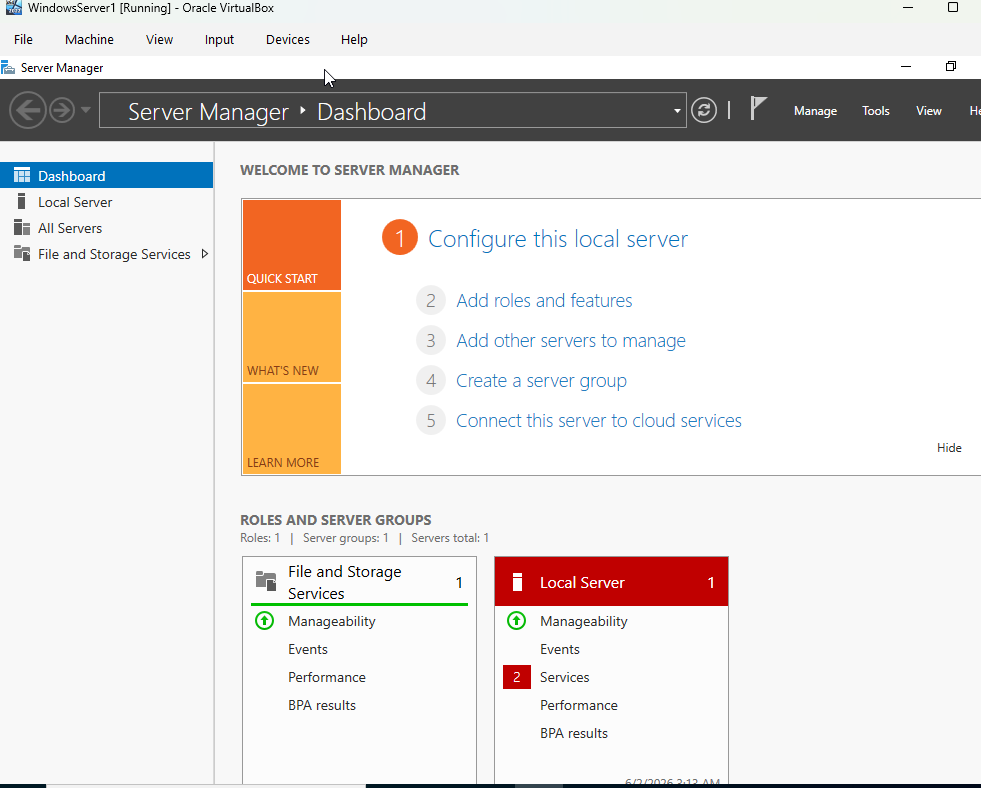

After installation, I confirmed that Windows Server loaded successfully. This verified that the server VM was ready for network and role configuration.

---

### 3. Configured a Static IP Address on the Server

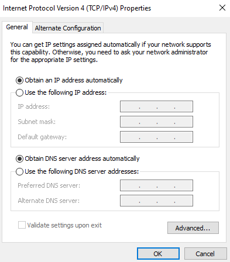

I configured a static IP address on the Windows Server VM. This is important because client machines need a consistent server address when connecting to the domain controller and DNS server.

---

### 4. Verified Server IP Configuration

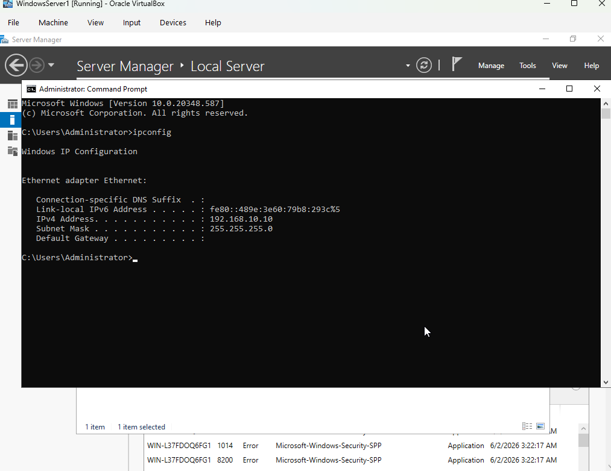

I used the command line to verify the server’s IP configuration. This confirmed that the server had the correct IP settings before installing and configuring Active Directory.

---

### 5. Installed Active Directory Domain Services

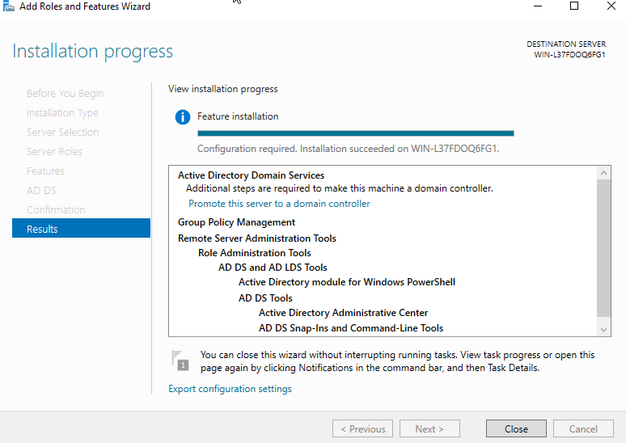

I installed the Active Directory Domain Services role using Server Manager. This role allows the server to manage domain users, computers, groups, and authentication.

---

### 6. Promoted the Server to a Domain Controller

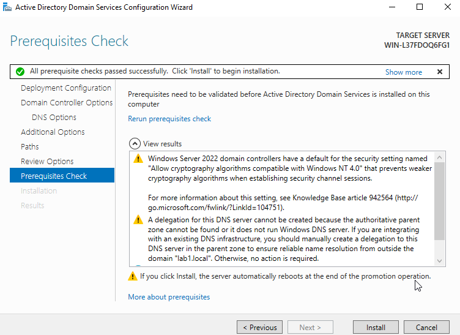

After installing Active Directory Domain Services, I promoted the server to a domain controller. This step created the domain environment that the Windows 11 client would later join.

---

### 7. Confirmed Active Directory Installation

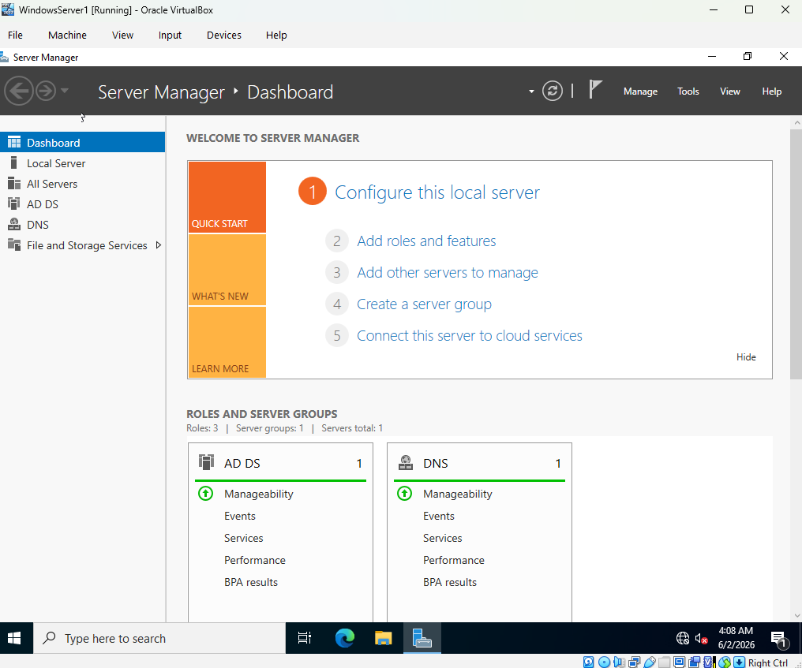

I confirmed that Active Directory was installed successfully and that the server was ready for domain management.

---

### 8. Created Organizational Units and Groups

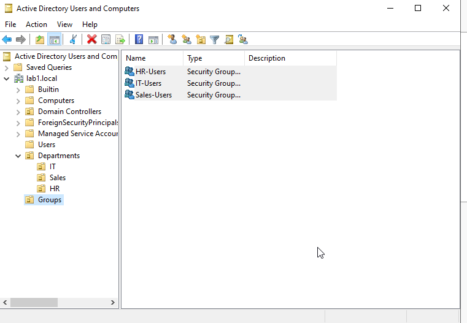

I created organizational units and groups in Active Directory to organize accounts by department or role. This simulates how businesses separate users and permissions in a domain environment.

---

### 9. Created Domain User Accounts

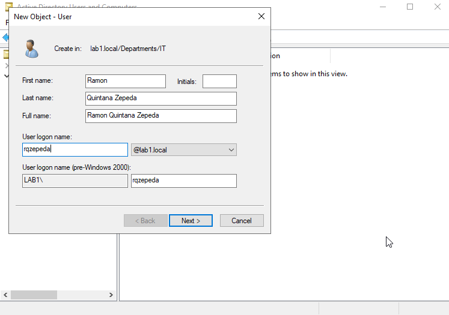

I created test domain user accounts in Active Directory. These accounts were used later to test logging into the Windows 11 client through the domain.

---

### 10. Verified Domain Users

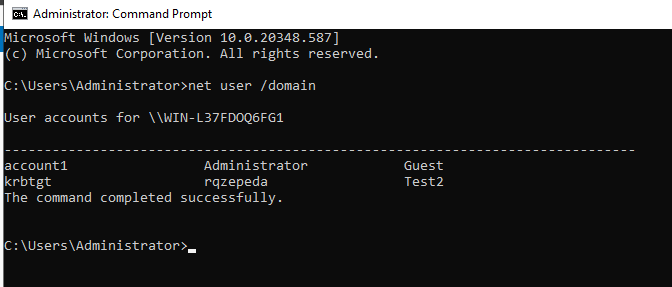

I confirmed that the domain users were created successfully in Active Directory Users and Computers.

---

### 11. Set Up the Windows 11 Client VM

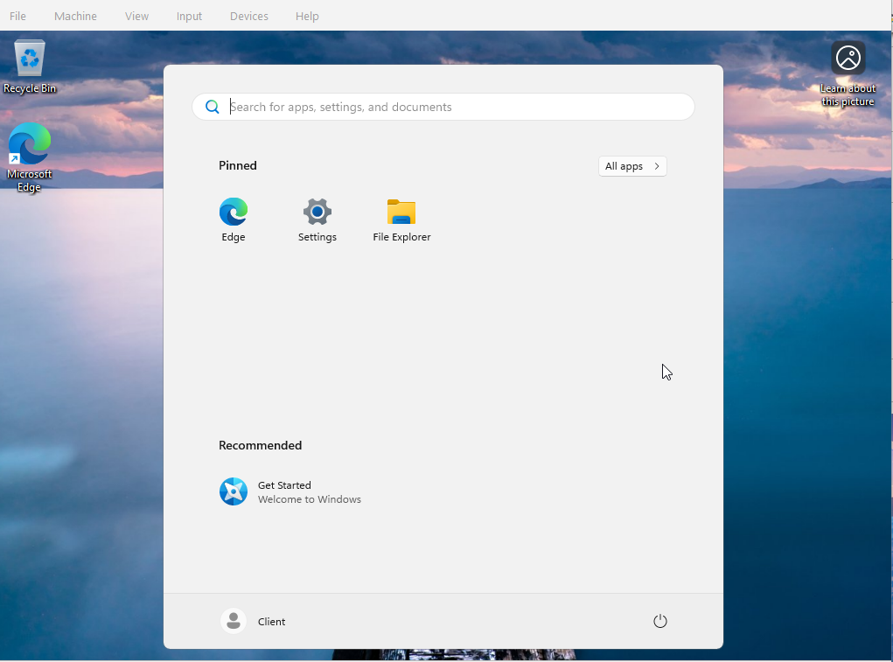

I installed and configured a Windows 11 virtual machine to act as the client workstation. This VM was used to test domain joining and domain user login.

---

### 12. Configured Windows 11 Network Settings

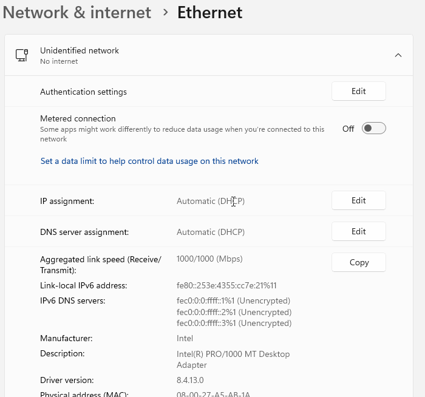

I configured the Windows 11 client network settings so it could communicate with the Windows Server domain controller. The client needed to use the server as its DNS server in order to locate and join the domain.

---

### 13. Tested DNS and Network Connectivity

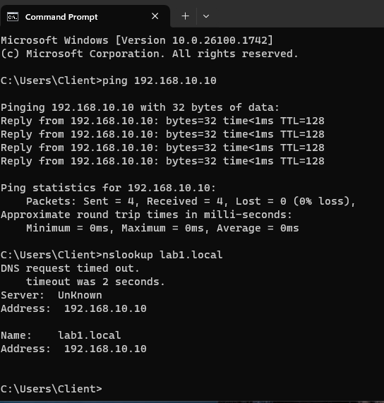

Before joining the domain, I tested network connectivity between the Windows 11 client and the Windows Server VM. I used ping and DNS checks to confirm that the client could communicate with the domain controller.

---

### 14. Joined Windows 11 to the Domain

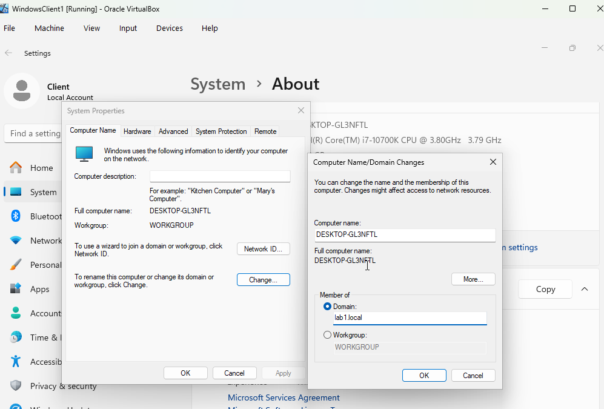

I joined the Windows 11 client computer to the Active Directory domain. This allowed the client machine to be managed by the domain controller and accept domain user logins.

---

### 15. Confirmed the Client Joined the Domain

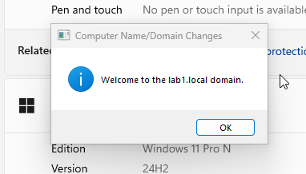

I confirmed that the Windows 11 client successfully joined the domain. This verified that the domain join process worked correctly.

---

### 16. Logged Into Windows 11 Using a Domain User

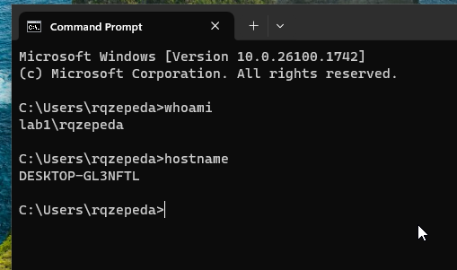

I tested logging into the Windows 11 client using a domain user account created in Active Directory. This confirmed that domain authentication was working from the client machine.

---

## Skills Demonstrated

- Windows Server installation and configuration
- Active Directory Domain Services setup
- Domain controller promotion
- DNS configuration and troubleshooting
- Static IP configuration
- Active Directory user, group, and organizational unit management
- Windows 11 domain joining
- Domain user login testing
- Command-line verification and troubleshooting
- Virtual machine networking
- Technical documentation

---

## Final Result

The final result was a working Active Directory home lab with a Windows Server domain controller and a Windows 11 client joined to the domain. Domain users were created in Active Directory and were able to log into the Windows 11 client successfully.

This project demonstrates basic system administration skills used in entry-level IT support, desktop support, and junior system administrator roles.
